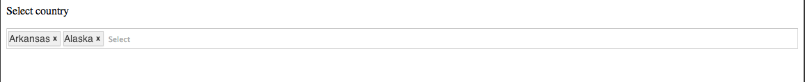

uxMultiselect
=============

A typeahead multiselect AngularJS directive.

Usage: 

```html
    <div data-ux-multiselect
        data-source="getAsyncDataMethod"
        data-displayfield='displayName'
        data-output='output'
        data-placeholder='Select'
        data-limit-filter=8></div>

    <div data-ux-multiselect
        data-source="sourceArray"
        data-displayfield='displayName'
        data-output='output'
        data-placeholder='Select'
        data-limit-filter=8></div>
```
Plunker: http://plnkr.co/hKmEm7lvkQU3TOynyi1r

By using data-typeahead-template-url="item.html" attribute is possible to give a template for the dropdown's items

